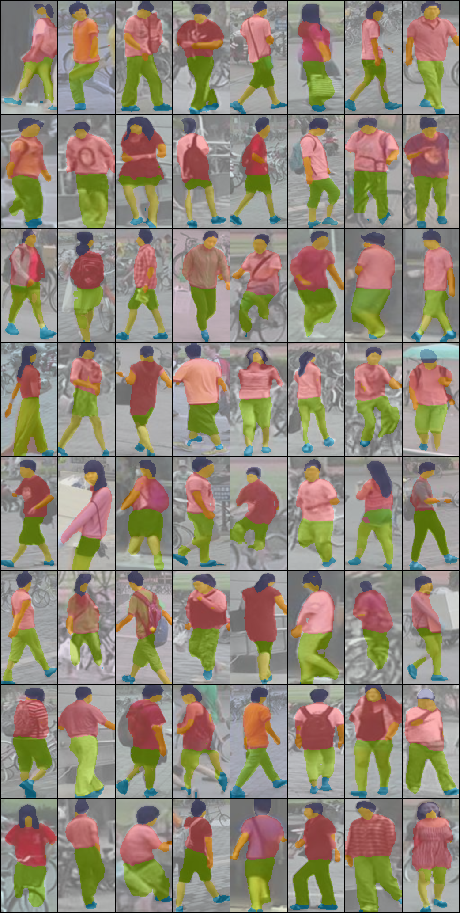

# Pedestrian Segmentation

[BiSeNetV2](https://github.com/CoinCheung/BiSeNet) pedestrian parsing model trained on [PPSS](http://mmlab.ie.cuhk.edu.hk/projects/luoWTiccv2013DDN/index.html) dataset. It can parsing hair, face, upperClothes, lowerClothes, arms, legs, shoes

## Parsing results

## Related recommended repos
- [Self-Correction-Human-Parsing] https://github.com/GoGoDuck912/Self-Correction-Human-Parsing
- [RobustVideoMatting] https://github.com/PeterL1n/RobustVideoMatting
